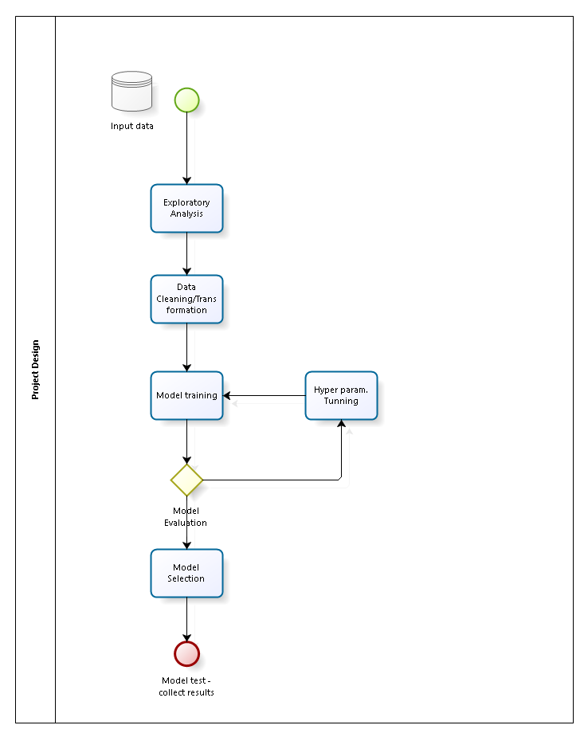

# Machine Learning Engineer Nanodegree
## Capstone Proposal
Braian O. Dias
August, 2018

## Proposal
Financial data is growing exponentially, helping institutions to improve their relationships with customers, offering tailor made products and reducing the overall risk of a credit operation. Kaggle offers a great opportunity to make good use of machine learning techniques to address a real world problem in a financial institution which borrows money to people that are currently underserved with loans. The main goal of the Kaggle challenge named **Home Credit Default Risk** (https://www.kaggle.com/c/home-credit-default-risk) sponsored by Home Credit Group, is to make use of a variety of alternative data to predict their clients' repayment abilities.

This project will try to answer the main challenge question, *"Can you predict how capable each applicant is of repaying a loan?"* with a decent accuracy, taking into account the results of others challege's applicants. All the data needed to develop the solution is available on Kaggle. As a current Fintech employee, which offers banking solutions to more than 700.000 customers in Brazil, it's a great opportunity to merge the Machine Learning techniques learned in the Nanodegree and apply it in my field of work.

### Domain Background

Financial institutions, in general, always try to measure the likelihood of a customer to pay a loan, using data from various sources to make this prediction. The bigger the risk the higher the interest rates and the risk of a loan default.
Alhtough this is not a new subject, the evolution of machine learning algorithms have helped to spread the utilization of them, as we can see in Flint's work named *"Predicting Student Loan Defaults"* and Chang, Dae-oong Kim and Kondo work named *"Predicting Default Risk of Lending Club Loans"* . The former tried to address the risk associated with student loans back in 1997, and the latter expressed its methods to achieve good results in a peer-to-peer lending company. Also, Liang has documented a similar problem in a Kaggle challenge in the work named *"Predicting borrowers’ chance of defaulting on credit loans"*.

**References :**

1. Thomas A. Flint, The Journal of Higher Education. Vol. 68, No. 3 (May - Jun., 1997), pp. 322-354
2. Shunpo Chang, Dae-oong, Kondo. Predicting Default Risk of Lending Club Loans. Stanford University.
3. Liang, Junjie. "Predicting borrowers’ chance of defaulting
on credit loans".

### Problem Statement

Home Credit is trying to minimize its loss due to loan defaults in a way that they accurately approve credit to customers that are likely to pay their debt. With supervised learning, we are able to build a model to predict their clients' repayment abilities, based on historical data provided by Home Credit through Kaggle.

### Datasets and Inputs

The data provided by Kaggle is comprised of 8 CSV files, with a main train/test file with reference to all the other files. The main file has the following configuration:

|       | Features | Observations |
| :---: | :---------------: | :---------------------: |
| **Train** |    121            |        307511           |
| **Test**  |    121            |        48744            |

Looking at the training data, it's possible to note that the target variable is not balanced:

* Number of training instances with TARGET 0 : 282686
* Number of training instances with TARGET 1 : 24825

This give us some detail of the main data, the description of additional files provided by the [Kaggle challenge](https://www.kaggle.com/c/home-credit-default-risk/data) are presented below:

**1. application_{train|test}.csv**:
This is the main table, broken into two files for Train (with TARGET) and Test (without TARGET).
Static data for all applications. One row represents one loan in our data sample.

**2. bureau.csv**:
All client's previous credits provided by other financial institutions that were reported to Credit Bureau (for clients who have a loan in our sample).
For every loan in our sample, there are as many rows as number of credits the client had in Credit Bureau before the application date.

**3. bureau_balance.csv**:
Monthly balances of previous credits in Credit Bureau.
This table has one row for each month of history of every previous credit reported to Credit Bureau – i.e the table has (#loans in sample * # of relative previous credits * # of months where we have some history observable for the previous credits) rows.

**4. POS_CASH_balance.csv**:
Monthly balance snapshots of previous POS (point of sales) and cash loans that the applicant had with Home Credit.
This table has one row for each month of history of every previous credit in Home Credit (consumer credit and cash loans) related to loans in our sample – i.e. the table has (#loans in sample * # of relative previous credits * # of months in which we have some history observable for the previous credits) rows.

**5. credit_card_balance.csv**:
Monthly balance snapshots of previous credit cards that the applicant has with Home Credit.
This table has one row for each month of history of every previous credit in Home Credit (consumer credit and cash loans) related to loans in our sample – i.e. the table has (#loans in sample * # of relative previous credit cards * # of months where we have some history observable for the previous credit card) rows.

**6. previous_application.csv**:
All previous applications for Home Credit loans of clients who have loans in our sample.
There is one row for each previous application related to loans in our data sample.

**7. installments_payments.csv**:
Repayment history for the previously disbursed credits in Home Credit related to the loans in our sample.
There is a) one row for every payment that was made plus b) one row each for missed payment.
One row is equivalent to one payment of one installment OR one installment corresponding to one payment of one previous Home Credit credit related to loans in our sample.

**8. HomeCredit_columns_description.csv**:
This file contains descriptions for the columns in the various data files.

Below is the diagram of the relation between each one of the files:

### Solution Statement

To answer the main challenge question, *"Can you predict how capable each applicant is of repaying a loan?"*, a Supervised Machine Learning model will be trained using the data described in the previous section. The trained classifier then will outputs, given some input data, if the customer is able to repay the loan.
The selected classification algorithms are Random Forests, Logistic Regression and SVM. The Performance of each one will be observed and the the model that gives the best area under the ROC curve between the predicted probability and the observed target will be selected.

### Benchmark Model

The chosen benchmark model was a previous work which deals with a similar problem in a Kaggle challenge, *"Predicting borrowers’ chance of defaulting on credit loans."*, by Liang. The performance metric used was the same required by the Home Credit Default Risk challenge, the AUC score. Details on the score funtion will be presented on the next section. Liang got an AUC score of 0.867262 using Random Forests. The full document can be seen here : http://cs229.stanford.edu/proj2011/JunjieLiang-PredictingBorrowersChanceOfDefaultingOnCreditLoans.pdf

### Evaluation Metrics

The evaluation of the model will be done using **area under the ROC curve** (AUC) between the predicted probability and the observed target.
According to Google (https://developers.google.com/machine-learning/crash-course/classification/roc-and-auc), "One way of interpreting AUC is as the probability that the model ranks a random positive example more highly than a random negative example".
AUC ranges in value from 0 to 1. A model whose predictions are 100% wrong has an AUC of 0.0; one whose predictions are 100% correct has an AUC of 1.0.
This is the metric defined by the Kaggle challenge and the goal is to score close to the top performers, or above the 3rd quartile.

### Project Design

The approach to solve the classification problem will follow the list of activities below :
1. Exploratory Analysis : Descriptive statistics of the data, outliers detection, correlation matrix, scatter plot matrix.
2. Cleaning/Transform data : Feature selection, feature scaling.
3. Model training : Train the model using the preprocessed input. The selected classification algorithms are Random Forests, Logistic Regression and SVM. Each model will be assessed using validation data and the one with the best accuracy will be selected for the next step.
4. Model selection : Select the best model after hyper parameters optimization.
5. Run classifier on test data and collect final results.

Below is a diagram of the overall architecture:

