# Machine Learning Engineer Nanodegree
## Capstone Project
Braian O. Dias,
September 12th, 2018

## I. Definition

### Project Overview 
Financial data is growing exponentially, helping institutions to improve their relationships with customers, offering tailor made products and reducing the overall risk of a credit operation. Kaggle offers a great opportunity to make good use of machine learning techniques to address a real world problem in a financial institution which borrows money to people that are currently underserved with loans. The main goal of the Kaggle challenge named **Home Credit Default Risk** (https://www.kaggle.com/c/home-credit-default-risk) sponsored by Home Credit Group, is to make use of a variety of alternative data to predict their clients' repayment abilities.

This project will try to answer the main challenge question, *"Can you predict how capable each applicant is of repaying a loan?"* with an acceptable accuracy. All the data needed to develop the solution is available on Kaggle in the form of .csv files that will be shown in detail later. As a current Fintech employee, which offers banking solutions to more than 700.000 customers in Brazil, it's a great opportunity to merge the Machine Learning techniques learned in the Nanodegree and apply it in my field of work.

### Problem Statement 
Home Credit is trying to minimize its loss due to loan defaults in a way that they accurately approve credit to customers that are likely to pay their debt. With supervised learning, we are able to build a model to predict their clients' repayment abilities, based on historical data provided by Home Credit through Kaggle.

The final solution will be built as follows :
1. Perform an Exploratory Analysis of the dataset;
2. Transform data to a suitable format to the machine learning algorithms;
3. Train a baseline model, and a state of the art model; 
4. Evaluate model results and adjust parameters;
5. Predict results on the test data and submit it to Kaggle to obtain the final score.

The final score will be obtained after submitting test predictions to Kaggle.

### Metrics
The evaluation of the model will be done using **area under the ROC curve** (AUC) between the predicted probability and the observed target.
According to Google (https://developers.google.com/machine-learning/crash-course/classification/roc-and-auc), "One way of interpreting AUC is as the probability that the model ranks a random positive example more highly than a random negative example", which means that it is a good choice for problems where the target variable is unbalanced. 
AUC ranges in value from 0 to 1. A model whose predictions are 100% wrong has an AUC of 0.0; one whose predictions are 100% correct has an AUC of 1.0. This is the metric defined by the Kaggle challenge to evaluate the best model.

## II. Analysis

### Data Exploration 
The data provided by Kaggle is comprised of 8 CSV files, with a main train/test file with reference to all the other files through the SK_xxx columns. The file *"HomeCredit_columns_description.csv"* contains information about each column in each file.
Below is a summary of all 8 available files : 1 main file for training (with target) 1 main file for testing (without the target), and 6 other files containing additional information about each loan.

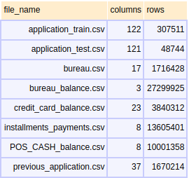

The training data has 307511 observations (each one a separate loan) and 121 features (variables) plus the TARGET (the label we want to predict). The test data follows the same structure, but it has 48744 observations and lacks the TARGET column.

We can see the first 10 observations of the main training data below :

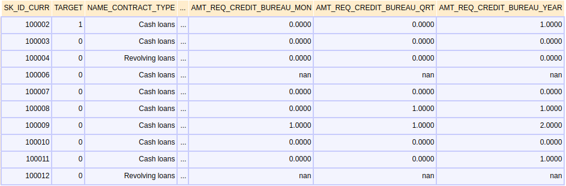

There are many features in the dataset, so in order to analyse them using the proper way the dataset will be splitted in numerical and non-numerical values. Then numerical features will be splitted in integer and float values.

* There are 16 NON-numerical features in the main dataset.
* There are 104 numerical features in the main dataset.
    * 39 are Int64 features
    * 65 are Float64 features

#### Numerical features
First, we will compute some basic statistics to determine how values are distributed, to understand the meaning of each one and also to detect anomalies.
Below are the statistics of the **integer features**, calculated through the *describe()* method of the pandas dataframe : 

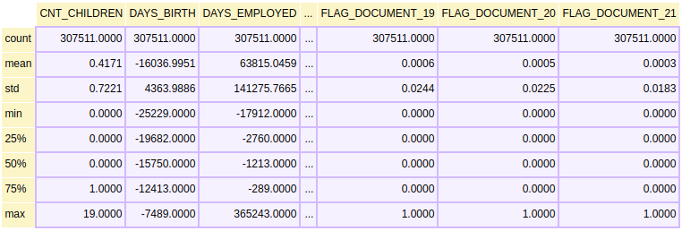

It can be seen that most of the integer features are in fact *binary features* already coded in [0,1], then those features will be classified as *int_binary_features* for the sake of feature transformation that will be performed later.
Also, there are features that represent count of days : ['DAYS_BIRTH', 'DAYS_EMPLOYED', 'DAYS_ID_PUBLISH']. One of them, ***DAYS_EMPLOYED***, which stores the count of days the applicant is employed, has a maximum value of 365243, which is more 1000 years. Let's investigate further and see how many observations this pattern has using a histogram.

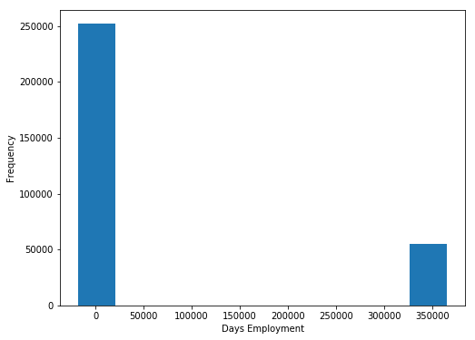

A total of **55374 days of employment** have issues. For now, nothing will be done about this anomaly, but it will be treated in the section *Data Preprocessing* later on this document.
Now, let's focus on the remaining numerical values, the **float features**. As seen previously, some basic statistics about the data was generated using the *describe()* method :

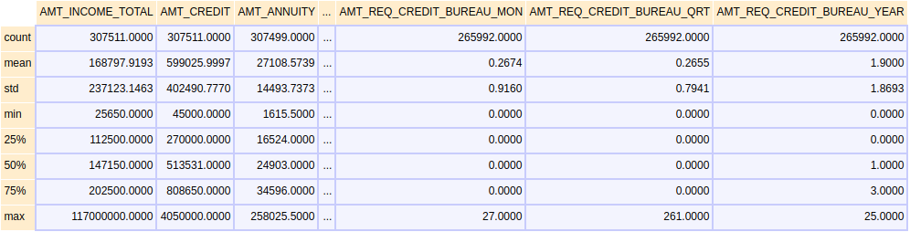

Now we start to see some differences between the count of each feature and the total count of observations in the dataset, which means there is **missing data** in these features. There is a total of 61 out of 65 float features with missing data, and the first 10 of them are presented below with the percentage of null values over the whole dataset.

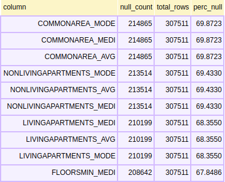

The table above shows that these top 10 features by missing count have about 68% of missing values over the whole dataset. This is a huge number, and the consequences of this characteristic of the data will be discussed later on the *Data Preprocessing* section.

#### Non-numerical features
The remaining class of features holds discrete data coded as text. Again python can output basic statistics of this data type, but instead of min, max, quantiles, mean and standard deviation, the method *describe()* give us an overview of the frequency and unique values of the discrete attribute. Below is the output of the pandas describe() method over the discrete data : 

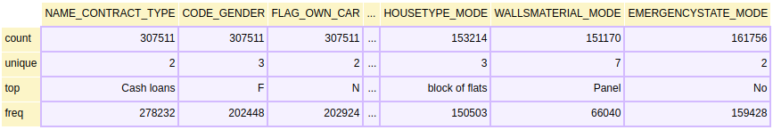

We can see from the data above that the features EMERGENCYSTATE_MODE has only two possible values (yes/no). However, this features is going to be treated as it has more than 2 categories, once we're going to introduce a new category to represent the NaN values. Other 3 features, ['NAME_CONTRACT_TYPE','FLAG_OWN_CAR','FLAG_OWN_REALTY'], have binary values, then they will be treated as *text_binary_features* in the data preprocessing phase .
It's also possible to note that there are **missing** values for some features, to understand this issue better, the following table presents the percentage of null discret values over the whole dataset.

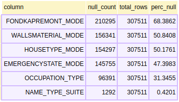

6 out of 16 discrete features has missing values, and 3 of them have more than half of the values missing. The strategies for data imputation will be discussed on the *Data Preprocessing* section.

To summarize, the whole main training dataset was analyzed accordingly to each feature data type. This process also separated the features into continuous (int and float features) and discrete (int/text binary features, discrete with many levels) features. With this distinction it will be possible to perform *label encoding* over discrete features in order to have them in a suitable format to train a machine learning model.

### Exploratory Visualization
The value we want to predict is either a 0, for the loan was repaid on time, or a 1, indicating the client had payment difficulties. Let's examine how loans are distributed on training data.

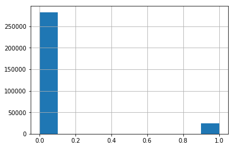

* Number of training instances with TARGET 0 : 282686
* Number of training instances with TARGET 1 : 24825

Looking at the chart above, it's possible to see that the target variable is not balanced in the training data. There are more loans that were repaid on time than loans that were not repaid.

Another interesting characteristic of the data is its high number of features (121) which makes impossible to plot a scatter_matrix to analyse trends over paired data. 
To focus on the more relevant features, let's see how each feature is correlated with the target using the Pearson Correlation Coefficient through corr() function. All scores below are absolute values, this way we obtain the top 10 features highly correlated with the target variable, independently if it's a positive or a negative correlation.

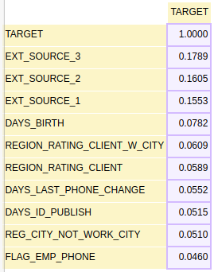

The strongest correlation is .17, which is a very weak correlation. It means that raw features alone won't be good predictors of the target variable. Let's take a look at the histogram for each one of the features above, in order to see if the strongest correlated features have any anomaly.

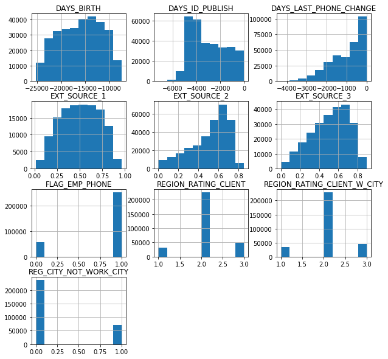

We can see above that there are some binary and continuous features. The feature "DAYS_BIRTH" caught my attention because of its maximum value (-25229), but it turns out that it's 69 years in days, which is a valid number.

### Algorithms and Techniques
To answer the main challenge question, *"Can you predict how capable each applicant is of repaying a loan?"*, a Supervised Machine Learning model will be trained using the data described in the previous section. The trained classifier then will outputs, given some input data, if the customer is able to repay the loan.

The selected classification algorithms are Random Forest and XGBoost. The former will be used as baseline, because is a classical Ensemble Algorithm, the latter is a recent approach widely used in Kaggle competitions. Each model will be assessed using validation data and the one with the best AUC will be selected for the next step.

**Random Forest** is a classical ensemble algorithm invented by Breiman and Cutler. It was chosen as a baseline because it's a simple method - and by its ensemble nature does not require much feature engineering - with a decent performance, and runs efficiently on large tabular, structured data. Although it works well with predefined parameters, it doesn't handle missing data. So, in order to train the model, all  missing values must be treated either removing the feature or imputing data.

**XGBoost** is a scalable machine learning system for tree boosting, which is used widely by data scientists to achieve state of the art results on many machine learning challenges. Both selected methods are classified as Tree Ensemble Models, whose the final prediction for a given example is the sum of predictions from each tree. Below is a figure that shows in a simple way how a Tree Ensemble Model works.

In many real-world problems, it is quite common for the input data to be sparse. There are multiple possible causes for sparsity: 1) presence of missing values in the data; 2) frequent zero entries in the statistics; and, 3) artifacts of feature engineering such as one-hot encoding. XGBoost has a Sparse Aware implementation with automatic handling of missing data values, so there's no need to preprocess these values. Although some data was imputed in order to train Random Forest, the original dataset with missing values will be used on XGBoost to prevent increasing error and bias as consequence of this data imputation.

### Benchmark
The AUC score for a classical Tree Ensemble method, Random Forest, will be used as a baseline. The work *"Predicting borrowers’ chance of defaulting on credit loans."*, by Liang has a similar underlying problem, predict default risk, and the final AUC score was 0.867262 using Random Forest. The full document can be seen here : http://cs229.stanford.edu/proj2011/JunjieLiang-PredictingBorrowersChanceOfDefaultingOnCreditLoans.pdf. Although it's not possible to compare both scores directly, because the dataset is completely different, it serves as a justification of the chosen baseline model.

The final classifier will use a recent tree boosting algorithm, presented by Tianqi Chen and Carlos Guestrin in 2016, called XGBoost. Once this classifier has many improvements over the classical Random Forest, it's expected that XGBoost performs better. 

## III. Methodology

### Data Preprocessing
As already discussed in other sections of this document, there are some data preprocessing tasks that need to be done in order to transform raw data to a suitable format for machine learning. Also there are some issues like outliers and missing data that need to be addressed. In the Data Exploration section we classified each feature according to the type of values it stores. Now, we're going to focus on transforming Non-numerical features into numbers.

#### Label encoding for discrete features
For discrete features with more than 2 unique values, where going to perform one-hot encoding, and for binary features we're going to perform label encoding. For the latter, there is one feature vector *text_binary_features*, which is going to be used to select this type of attribute. We then use the *LabelEncoder()* sklearn class to encode the binary features in [0,1]. This transformation also need to be applied in the test dataset to make sure the input is the same on training and prediction.

Binary features are complete on the dataset (there is no NaN values), however, the same doesn't occur in the rest of non-numerical features. As shown in the Data Exploration, there are 6 features with missing values. To adjust that, instead of imputing the most frequent term where the value is null, we're going create a new unique value called 'NOT_INF' (short for 'not informed'). In other words, the lack of information will be treated as information. After assigning 'NOT_INF' to observations with missing data we are ready to perform one-hot encoding.

One-hot encoding can be done easily by the pandas method *pd.get_dummies()* and need to be done for both train and test set. There need to be the same features (columns) in both the training and testing data. When performed One-hot encoding, it has created columns in the training data with categories not represented in the testing data. To adjust the dataset we use the pandas function  *align*, which drops columns of the train dataframe that doesn't exist in test dataframe.

After label encoding we increased our number of features from 121 to 245, but they are all numerical now.

#### Outliers
In the *Data Exploration* section we've seen an outlier in *DAYS_EMPLOYED* column. First, a new boolean column indicating whether or not the value was anomalous will be created. It will be called "DAYS_EMPLOYED_OUTL", and will store 1 in case it's an outlier and 0 if it's not. Then, those outliers will be set to NaN using numpy *np.nan*. Below we can see two histograms showing the distribution of the DAYS_EMPLOYED values before and after removing the outliers.

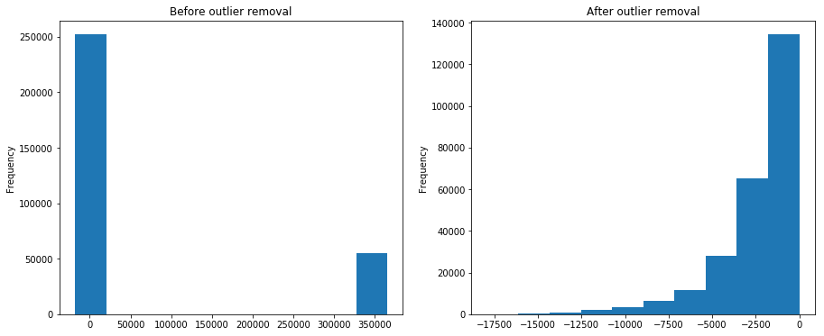

The resulting distribution shape seems more reasonable now, and we also added a new feature to track if the observation was originally anomalous. Note that we must run the same process for both train and test dataset. In the next section the NaN value introduced by this data cleansing will be treated together with the other features containing NaN values.

#### Dealing with missing data
After we addressed the missing data in discrete features, we need to do the same with numerical features. Despite XGBoost automatic handles missing data, as described in its documentation, we need to impute data in order to train our baseline classifier, Random Forest. To be able to train XGBoost without data imputation, we're going to create a copy of the train and test dataset to perform the next transformations. 
There are 61 numerical features with at least one missing value in the dataset. The chart below displays the percentage of missing data for each feature.

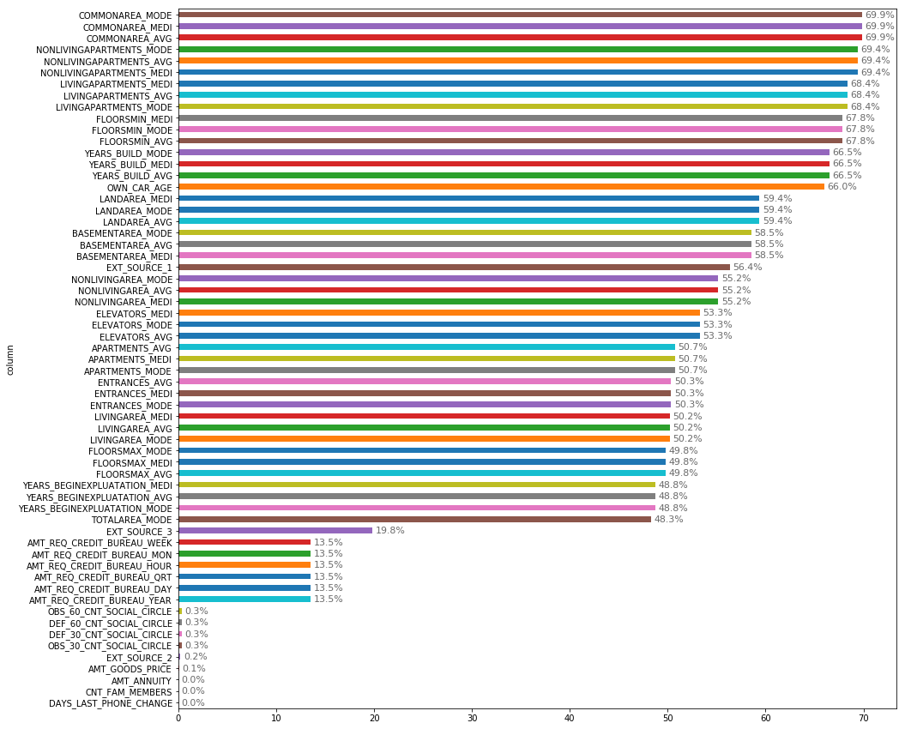

We can clearly see that the majority of columns with more than 49% of missing values are information about building where the client lives. As described in the dataset documents, it is a normalized value, so we're going to replace all null values with the **median** of each feature using numpy function *np.nanmedian()*.

### Implementation
The implementation consists of training and evaluate two classification algorithms and report their AUC score:
1. Train a baseline model - Random Forest - and analyse its prediction results over a validation set;
2. Train a state of the art model - XGBoost - and analyse its prediction results over a validation set.
3. Train a state of the art model with imputed data - XGBoost - and analyse its prediction results over a validation set.

#### Random Forest
The baseline model, Random Forest, will be trained with the **preprocessed train data, without NaN values**. During this stage the sklearn *RandomForestClassifier()* will be used with its default parameters, using cross-validation with 10 folds. The scoring function is 'roc_auc'.

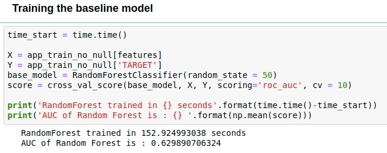

#### XGBoost
Now the competition winner XGBoost will be trained with the **preprocessed train data, including NaN values**. As discussed before in this document, XGBoost can handle missing data and so it will be used with its default parameters. The remaining settings will be kept : cross-validation with 10 folds and scoring function is 'roc_auc'.

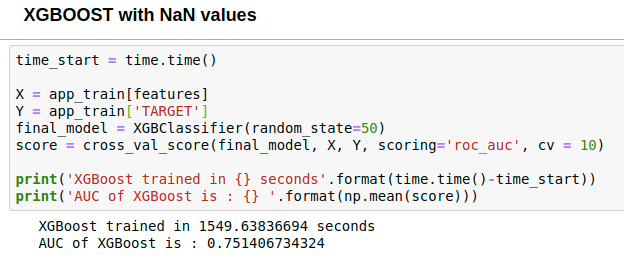

To check if the data imputation process really degrade the final score, let's also train a XGBoost classifier with **preprocessed train data, without NaN values**, the same dataset used with Random Forest. All the remaining settings are the same as the two previous runs.

# FALTA
### Refinement
The first results with default parameters were not bad, and we can clearly see that XGBoost is more robust than Random Forest. However, we can make use of a well known technique for parameter optimization called Grid-search. Grid-searching is the process of scanning the data to configure optimal parameters for a given model. Depending on the type of model utilized, certain parameters are necessary. It is important to note that Grid-searching can be extremely computationally expensive and may take your machine quite a long time to run. Grid-Search will build a model on each parameter combination possible. It iterates through every parameter combination and stores a model for each combination.

Due to the lack of computational resources, the number of parameters and range of each one will be limited. The table below shows each parameter that will be tested and their possible values. First, let's setup the parameters for Random Forest:

|  Parameter            | Possible Values |
| :-------------------: | :---------------: |
| **max_depth**         |    [10,50]        |      
| **min_samples_leaf**  |    [1,4]          |
| **min_samples_split** |    [2,10]         |  
| **n_estimators**      |    [200,1000]     |       

The configuration above resulted in 16 models (2 x 2 x 2 x 2) and took approximately X hours to train. The final AUC score for the best model selected by the Grid Search was XX.

TALK ABOUT THE IMPROVEMENT

Below is a summary of all runs for each classifier and it's score. The ones __***highlited***__ are the candidates for submission on Kaggle.

|  Algorithm           | AUC               |  Training time | Prediction time |
| :-------------------:| :---------------: | :---------------: |:---------------: |
| **Random Forest**    |                   |                   |                  |      
| **XGBoost**          |        (+x%)        |            (+xs)       |          (-xs)        |

In this section, you will need to discuss the process of improvement you made upon the algorithms and techniques you used in your implementation. For example, adjusting parameters for certain models to acquire improved solutions would fall under the refinement category. Your initial and final solutions should be reported, as well as any significant intermediate results as necessary. Questions to ask yourself when writing this section:
- _Has an initial solution been found and clearly reported?_
- _Is the process of improvement clearly documented, such as what techniques were used?_
- _Are intermediate and final solutions clearly reported as the process is improved?_

## IV. Results
_(approx. 2-3 pages)_
# FALTA
### Model Evaluation and Validation
The best model was the XGBoost, with the parameters set obtained through Grid-search, with a test AUC score of XX. 

In this section, the final model and any supporting qualities should be evaluated in detail. It should be clear **how the final model was derived and why this model was chosen**. In addition, some type of analysis should be used to validate the robustness of this model and its solution, such as manipulating the input data or environment to see how the model’s solution is affected (this is called sensitivity analysis). Questions to ask yourself when writing this section:
- _Is the final model reasonable and aligning with solution expectations? Are the final parameters of the model appropriate?_
- _Has the final model been tested with various inputs to evaluate whether the model generalizes well to unseen data?_
- _Is the model robust enough for the problem? Do small perturbations (changes) in training data or the input space greatly affect the results?_
- _Can results found from the model be trusted?_

# FALTA
### Justification
Both selected models are widely used as a classifier for tabular structured data with a decent performance. Based on the achieved results, we proved the hypothesis that XGBoost performs better than Random Forest, without much penalty from a computational resources perspective. Below is a table that compares the best model achieved for each algorithm.

|  Algorithm           | AUC               |  Training time | Prediction time |
| :-------------------:| :---------------: | :---------------: |:---------------: |
| **Random Forest**    |                   |                   |                  |      
| **XGBoost**          |        (+x%)        |            (+xs)       |          (-xs)        |
     

Gráfico com as AUC curves?

dizer que o modelo do paper da chinesa tinha menor complexidade

In this section, your model’s final solution and its results should be compared to the benchmark you established earlier in the project using some type of statistical analysis. You should also justify whether these results and the solution are significant enough to have solved the problem posed in the project. Questions to ask yourself when writing this section:
- _Are the final results found stronger than the benchmark result reported earlier?_
- _Have you thoroughly analyzed and discussed the final solution?_
- _Is the final solution significant enough to have solved the problem?_

## V. Conclusion

# FALTA
### Free-Form Visualization

In this section, you will need to provide some form of visualization that emphasizes an important quality about the project. It is much more free-form, but should reasonably support a significant result or characteristic about the problem that you want to discuss. Questions to ask yourself when writing this section:
- _Have you visualized a relevant or important quality about the problem, dataset, input data, or results?_
- _Is the visualization thoroughly analyzed and discussed?_
- _If a plot is provided, are the axes, title, and datum clearly defined?_

### Reflection
The process used for this project was comprised of 5 major tasks:
1. Perform an Exploratory Analysis of the dataset;
2. Transform data to a suitable format to the machine learning algorithms;
3. Train a baseline model, and a state of the art model; 
4. Evaluate model results and adjust parameters;
5. Predict results on the test data and submit it to Kaggle to obtain the final score.

Among all these steps, the Exploratory Analysis was by far the most difficult task. The chosen dataset contains a lot of features which makes difficult to analyse every 121 original features in detail. There are some traditional data visualization techniques that cannot be applied to such a high dimensional dataset. Also, some domain knowledge is needed in order to understand how they can help the model or being discarded from the training data. But in the end, the whole project was an interesting case on how well a machine learning algorithm can perform in a real world problem. The final score was somewhat close to the kaggle top scorers. Also, as a new employee of a financial institution, the knowledge obtained doing this project will certainly improve my career.

### Improvement
From a machine learning perspective, there is another tree based algorithm called LightGBM that could be tested against XGBoost. It has proven to be a good option for classification problems and it's being adopted as one of the most used algorithms on kaggle competitions. Also, Bayesian optimization methods for hyperparameter tuning could have helped find the best set of hyperparameters for this problem. 
I believe as a future work I would test LightGBM, Bayesian optimization and also would spend more time analysing each feature and try to come up with new features to improve the score.

-----------

**Before submitting, ask yourself. . .**

- Does the project report you’ve written follow a well-organized structure similar to that of the project template?
- Is each section (particularly **Analysis** and **Methodology**) written in a clear, concise and specific fashion? Are there any ambiguous terms or phrases that need clarification?
- Would the intended audience of your project be able to understand your analysis, methods, and results?
- Have you properly proof-read your project report to assure there are minimal grammatical and spelling mistakes?
- Are all the resources used for this project correctly cited and referenced?
- Is the code that implements your solution easily readable and properly commented?
- Does the code execute without error and produce results similar to those reported?
